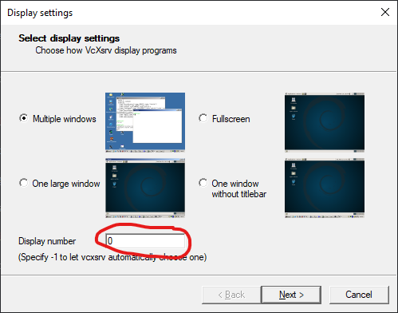
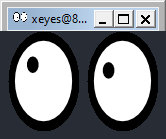

# COMP371 Docker Image

## Overview

Docker is a service that provides a customized and isolated environment for processes.

It works by creating an image which stores the data for the environment in
which to run processes. Images are created according to the instructions in a
Dockerfile (eg: `Dockerfile.comp371`). To create images Docker downloads a
previously existing image (usually an unmodified OS from
`https://hub.docker.com`). To build up the image each command in the Dockerfile
acts as a layer until it reaches either the `ENTRYPOINT` or `CMD` commands.

`ENTRYPOINT` is used to run the container as a process it takes arguments on
the command line and passes them to the `ENTRYPOINT` command. It can be
overwritten with the `--entrypoint` parameter.

`CMD` runs a default command. It will be overridden using `-it` parameter which
will use the default shell.

Containers run the `ENTRYPOINT`, `CMD` or default shell in the image
environment built by the container and can be regarded as running process
isolated from the rest of the host system.

## Inside Dockerfile.comp371 Image

The Docker image build with `Dockerfile.comp371` uses Ubuntu 20.04 as a base
and adds C++, OpenGL, GLFW and Eigen3 libraries as well as the GCC compiler,
the CMake build system and text editors (Emacs, Vim and Nano).

The following files are also imported into it:

`docker/CMakeLists.txt`: basic CMakeLists for building an OpenGL+GLFW+Eigen+GLM application. This is
placed inside the `/examples` directory.

`docker/build_and_run.sh`: runs cmake and and takes one argument for the
project name. This is imported into the `/scripts` directory.

## Preparation

### 0: Make sure the Docker service is running.

#### Linux:

This is generally done with systemd.

```
systemctl start docker
```

#### Windows:

Open Docker from the start menu. It should show up in the system tray as well.

### 1: Build

#### Linux:

To build the image type the following in a from this directory terminal:

```bash
./linux/build_docker.sh
```

#### Windows:

For Windows use a PowerShell terminal from this directory:

```powershell
./windows/build_docker.ps1
```

### 2: Set up X Server

#### Linux

Linux usually has an X Server running for its GUI system by default.

It may be necessary to give it permission to let external GUI applications call the X Server. To do this type the following:

```bash
xhost +SI:linuxuser:root
```

To restore defaults

```bash
xhost -
```

#### Windows

[Xming](https://sourceforge.net/projects/xming/) or [VcXsrv](https://sourceforge.net/projects/vcxsrv/) should already be installed on the H962 an H966 machines.

Then run XLaunch

1. Select **Multiple Windows**


2. Set **Display** to **0**



3. Select **Start no client**


4. Check **Disable Access Control**


5. Test the Server

Get your WSL IP address:
```powershell
ipconfig
```

Under the `Ethernet adapter vEthernet (WSL):` header there should be a line containing `IPv4 Address`. (This automated in the `interactive_run.ps1` and `run.ps1` scripts)

And then run the following in the PowerShell:

```powershell
docker build -f Dockerfile.xeyes . -t xeyes
docker run --rm --name xeyes -e DISPLAY=<your_IPv4_address>:0.0 xeyes:latest
```

This creates a simple Docker image and runs a container that only contains the
`xeyes` application as seen below.



## Running

`interactive_run.{sh,ps1}` will open a bash terminal inside the container. It
takes a path to your code as an argument to link to `/COMP371` inside the
container. You can build your code inside this environment and run it.

`run.{sh,ps1}` will automatically build and run the code attached to
`/COMP371`. It builds the code using an the CMakeLists file contained inside
the Docker image and names the program after the first parameter given to the
script.

### Examples

#### Linux

```bash
# Interactive Mode
./linux/interactive_run.sh $PWD/COMP371_all/Lab_capsules/capsule1/code

# Run
./linux/run.sh capsule1 $PWD/COMP371_all/Lab_capsules/capsule1/code
```

#### Windows (PowerShell)

```powershell
# Interactive Mode
.\windows\interactive_run.ps1 ${pwd}\COMP371_all\Lab_capsules\capsule1\code

# Run
.\windows\run.ps1 capsule1 ${pwd}\COMP371_all\Lab_capsules\capsule1\code
```

You can also test that GLFW is working with the simple GLFWTest code

#### Linux

```bash
./linux/run.sh GLFWTest $PWD/GLFWTest
```

#### Windows (PowerShell)

```powershell
.\windows\run.ps1 GLFWTest ${pwd}\GLFWTest
```

## Warnings

### The Linked Folder is Writable

The linked Docker folder is writable by the docker process. Any changes made
within the folder will persist after the process is exited, so it is necessary
to make sure there are backups.

### Building Docker Images Takes Up Space

Remember to delete your images when they are done as they can take up a lot of
space on the hard drive. the `delete_image.{sh,ps1}` script can be used

You can also clear images that are no longer in use by typing the following into either Bash or PowerShell:

```bash
docker image prune
```

## Other scripts

`utils.{sh,ps1}`: contains utility functions for the `interactive_run.{sh,ps1}` and `run.{sh,ps1}` scripts
`delete_container.{sh,ps1}`: deletes the container named `COMP371`
`delete_image.{sh,ps1}`: deletes the image named `comp371:W22`
`rebuild.{sh,ps1}`: deletes the container and image and rebuilds them

## TODO

* Clean up main directory
* Add X Server instructions
* Add GLFW test

